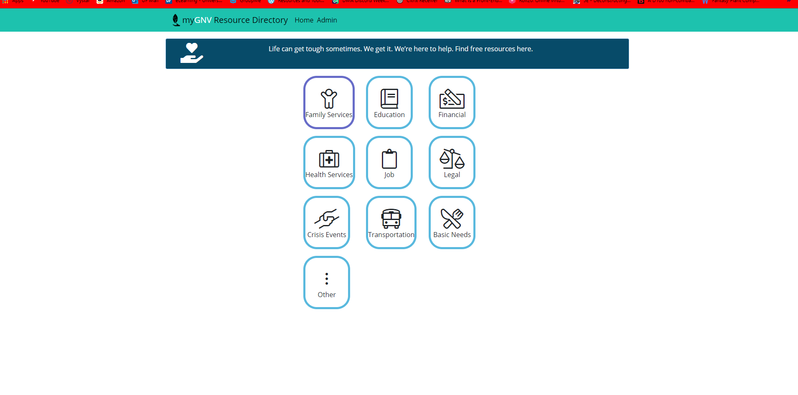
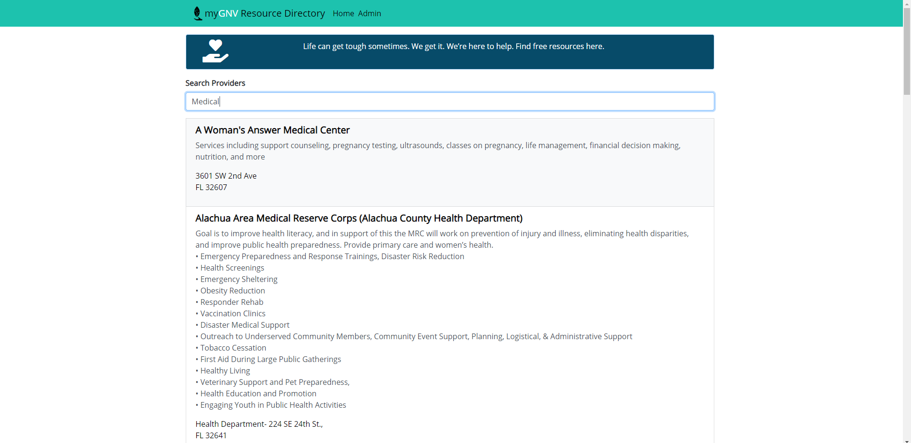
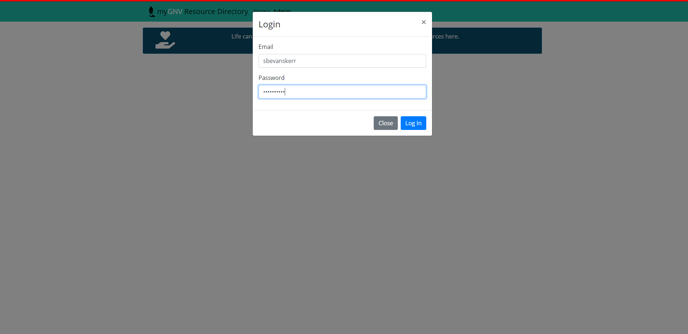
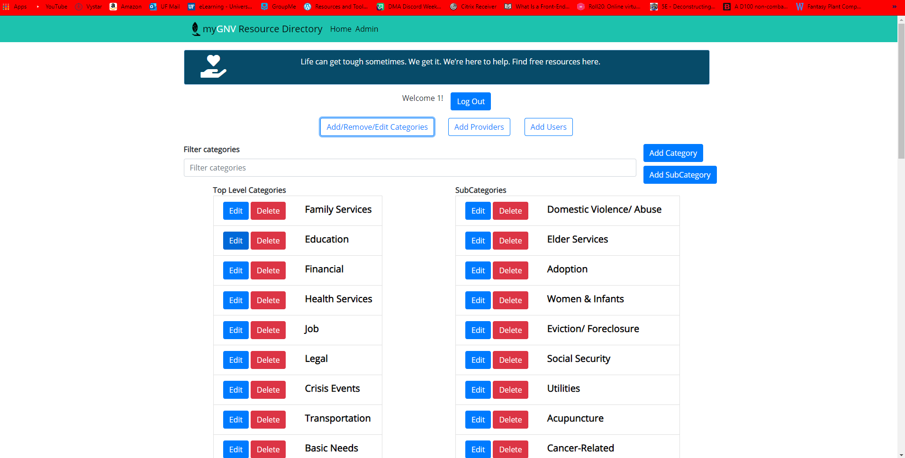
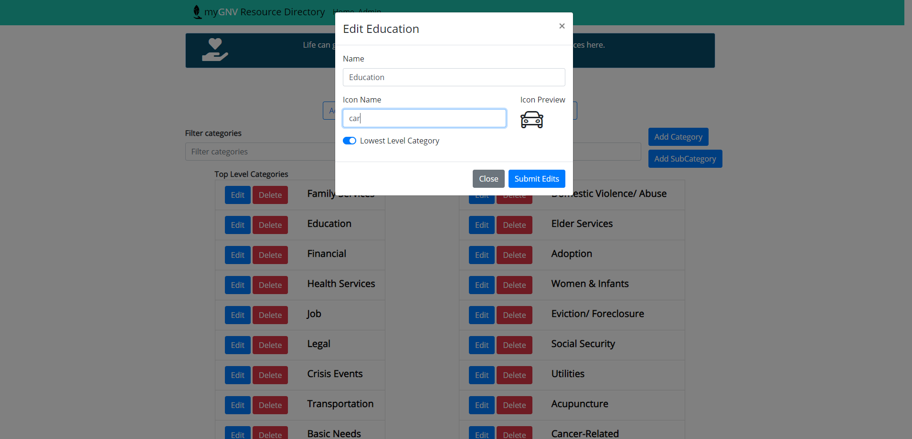

# MyGNV

A React + Express Webapp to help Gainesville residents find resources easier.

https://mygnv.herokuapp.com/

## Getting Started Locally

1. Clone the repo
2. `cd mygnv-team-10d`
3. Configure the .env file with the DB_URI, rename from `.env.sample` to `.env`
4. `npm install`
5. `npm run dev`
6. Navigate to `localhost:8080`

## Deploying to Heroku

Instructions to deploy on Heroku are as follows:

1. Download and install the Heroku CLI
2. Login to Heroku with `heroku login`
3. `heroku git:remote -a <app_name> `, replacing <app_name> with heroku application name
4. Set up environment variables
    1. `heroku config:set SESSION_SECRET=’<session_secret>’`, replacing <session_secret> with the session secret
    2. `heroku config:set DB_URI=’<db_uri>’`, replacing <db_uri> with the DB uri
7. `git push heroku master`
    1. `heroku logs --tail` to see the logs

## Api Documentation

/api/category  
GET will return JSON of all categories  
POST will create category if user authenticated  

/api/category/topLevelCategory  
GET will return JSON of all top level categories  

/api/category/subCategory/:categoryId  
GET will return list of subCategories under parent category's id  

/api/category/:categoryId  
GET will return category  
POST will update category if authenticated  
DELETE will delete category if authenticated  

/api/provider  
GET will return JSON of all providers  
POST will create provider if user authenticated  

/api/provider/:providerId  
GET will return provider  
POST will update provider if authenticated  
DELETE will delete provider if authenticated  

/api/provider/subCategory/:categoryId  
GET will return list of providers under subcategory id  

/api/user/login  
POST with correct email and password field  
will login and start session  

/api/user/logout  
POST will end session if there in an active session  

/api/user/isLoggedIn  
POST will return status: true in JSON if logged in  

/api/user/register  
POST with email and password field  
Will create new user if request is from authenticated user  

## Linting your Code

Before making a pull request, please lint and fix your code.

1. `npm run lint`

The linter can automatically fix some (not all) issues with the below command.

2. `npm run lint:fix`

## Building for Deployment

1. `npm run build`
2. `npm start`
3. Built files are being served on `localhost:8080`, or at another port, depending on env config.

## Create, Checkout & Check-in Branches

When starting a new feature, work in a feature branch.

1. `git pull`
2. `git checkout -b initials/featureName`

Now you can add commits and check in the branch.

3. `git add whatever_needs_to_be_added`
4. `git commit -m "commit message"`
5. `git push origin initials/featureName`

If you have any merge conflicts when pulling and you have issues ask for help ASAP.

## Bring your feature branch up to date with master

1. `git checkout master`
2. `git fetch -p origin`
3. `git merge origin/master`
4. `git checkout initials/featureName`
5. `git merge master`

If there are merge conflicts a text editor may open. VScode is great for this since it shows the diffs and changes clearly. Edit the merge commit to fix issues and commit your updated branch with `git push origin initials/featureName`.

## Make Pull, Push & Merge Requests

When you want to integrate your feature into master, make a pull request on github from your branch and wait until it is reviewed and merged by a team member.

To prevent merge conflicts, talk with team members before making large changes. Bring your feature branch up with master often to prevent merge conflicts when trying to merge pull requests.

## Technology Stack Used

More dependency information can be found in package.json.

- MongoDB
- Express
- React
- Node.js
- Bootstrap

## Feature List

Proposed
- Users accounts and log-ins
- Administrator side 
- Admin can modify providers list
- Admin can modify categories and sub-categories for providers
- Email/Text capability so that anonymous users can save information
- Ability to filter out and search results from the providers list that is connected to database
- Ability to filter out and search results from providers list based on categories and subcategories which are dynamically updated
- Users can view providers list and view individual providers
- Individual provider will display information 

Completed
- Users accounts and log-ins
- Administrator side 
- Admin can modify providers list
- Admin can modify categories and sub-categories for providers
- Ability to filter out and search results from the providers list that is connected to database
- Ability to filter out and search results from providers list based on categories and subcategories which are dynamically updated
- Users can view providers list and view individual providers
- Individual provider will display information

## Screenshots

Category view: Each user can search for a provider based on a category they choose. These categories can go several layers.

Provider info: When each provider is selected, it pulls information from the database, supplying the user with a description, location, contacts information and more.

Provider search: Users can search for any provider if they already know what they’re looking for using a dynamic search bar. This links back to the database.

Login: If a user has an admin account, they may login to the admin portal using a secure password and login.

Category admin page: Admins can search for providers to delete and edit. They can edit categories, subcategories, icons, and names of every provider. This effectively allows any admin to control the entire database of providers. 

